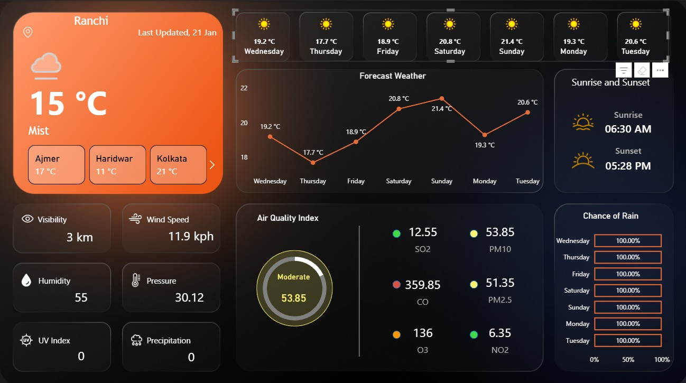

# 🌦️ Weather Analytics Dashboard (Power BI)

## 📌 Project Overview

The **Weather Analytics Dashboard** is an interactive Power BI project designed to visualize and analyze weather conditions across different locations. It provides real-time insights into temperature trends, air quality, and atmospheric conditions in a visually appealing and user-friendly format.

---

## 🎯 Objectives

* To monitor and analyze weather conditions efficiently
* To visualize multi-parameter weather data in a single dashboard
* To provide actionable insights for environmental awareness

---

## 📊 Dashboard Features

### 🌡️ Temperature Insights

* Current temperature display with weather condition (e.g., Mist)
* 7-day forecast visualization using line charts
* Daily temperature comparison cards

### 🌍 Multi-City Comparison

* Compare weather across cities like Ajmer, Haridwar, and Kolkata
* Easy navigation between locations

### 🌫️ Air Quality Index (AQI)

* AQI status indicator (e.g., Moderate)
* Detailed pollutant breakdown:

  * SO₂, NO₂, CO, O₃
  * PM2.5 and PM10 levels

### 🌦️ Weather Parameters

* Visibility (km)
* Wind Speed (kph)
* Humidity (%)
* Pressure
* UV Index
* Precipitation levels

### 🌅 Sunrise & Sunset

* Displays daily sunrise and sunset timings

### ☔ Rain Probability

* Day-wise chance of rain visualization (percentage bars)

---

## 🛠️ Tools & Technologies

* **Power BI Desktop**
* **Power Query** (Data Cleaning & Transformation)
* Data Source: Weather dataset (API / CSV / Excel)

---

## 📷 Dashboard Preview

---

## 🚀 How to Use

1. Download the `.pbix` file from this repository
2. Open using **Power BI Desktop**
3. Refresh data if connected to a live source
4. Use slicers and filters to explore different cities and weather parameters

---

## 📈 Key Insights

* Identifies temperature trends over a week
* Helps monitor air pollution levels effectively
* Enables comparison of weather conditions across multiple cities
* Provides quick understanding of environmental conditions

---

## 🔮 Future Enhancements

* Integration with real-time weather APIs
* Predictive analytics using Machine Learning
* Mobile-optimized dashboard
* Alerts for extreme weather conditions

---

## 👩‍💻 Author

**Shreya Raj**

---

## 📄 License

This project is for educational and portfolio purposes only.
